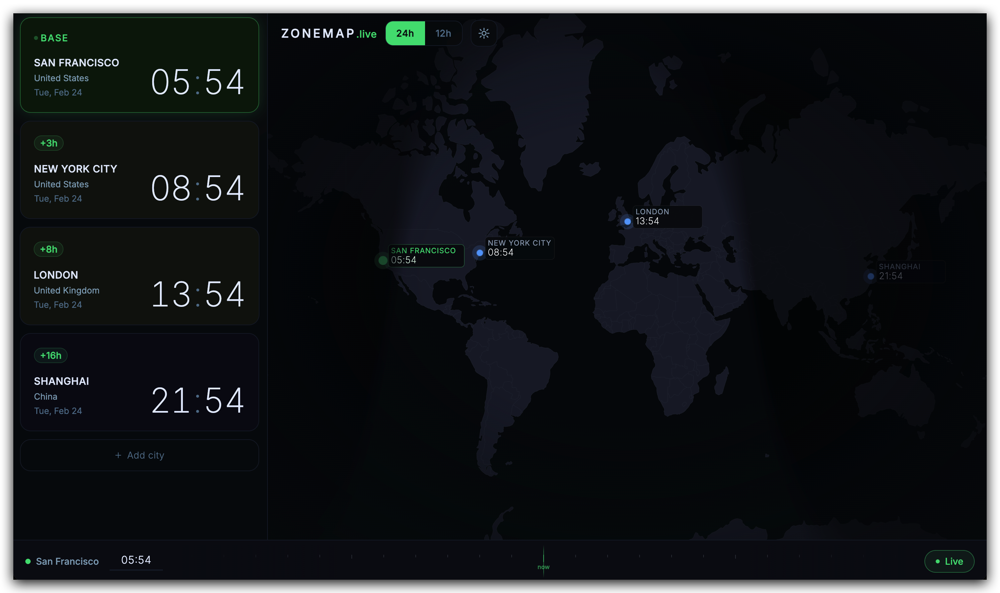

# ZoneMap

**[zonemap.live](https://zonemap.live)**

A timezone visualization web app. See the current time across multiple cities on an interactive world map, with a live day/night terminator line.



## Features

- **Live world clock** — time updates at the top of every minute with no drift
- **Interactive map** — Mercator projection with country outlines and city markers
- **Day/night terminator** — astronomically accurate solar boundary rendered on a Canvas overlay
- **City cards** — add/remove cities, click to set the base timezone
- **Time scrubbing** — drag the slider or type a time to explore any moment of the day
- **12h / 24h toggle** — applies to cards, map labels, and the time input
- **URL state** — share or bookmark a specific view; state restores on reload
- **58 cities** — searchable list spanning all major timezones

## Getting Started

```bash
npm install
npm run setup   # copies world map data into public/
npm run dev     # http://localhost:5173
```

`npm run setup` copies `node_modules/world-atlas/countries-110m.json` to `public/world-110m.json`. This only needs to be run once.

## Scripts

| Command | Description |
|---|---|
| `npm run dev` | Start dev server |
| `npm run build` | Type-check + production build |
| `npm run preview` | Preview the production build |
| `npm run lint` | Run ESLint |
| `npm run setup` | Copy world map TopoJSON to `public/` |

## Tech Stack

| | |
|---|---|
| Framework | React 18 + TypeScript (strict) |
| Build | Vite 5 |
| Styling | Tailwind CSS 3 |
| Animation | Framer Motion 11 |
| Time | date-fns + date-fns-tz |
| Geography | D3-geo + topojson-client + world-atlas |

## Project Structure

```
src/
├── App.tsx              # Root state + URL sync
├── types/index.ts       # Shared TypeScript interfaces
├── data/cities.ts       # 58 cities with IANA timezones
├── utils/
│   ├── terminator.ts    # Solar terminator calculation (USNO algorithm)
│   ├── timeUtils.ts     # Timezone formatting helpers
│   └── mapUtils.ts      # Mercator projection utilities
├── hooks/
│   ├── useClock.ts      # Drift-free per-minute tick
│   └── useUrlSync.ts    # Debounced URL state sync
└── components/
    ├── cards/           # CityCard, CityCardRow, AddCityButton
    ├── map/             # WorldMap, MapBackground, CityMarkers, TerminatorCanvas
    ├── controls/        # TimeControl, TimeInput, TimeSlider
    └── search/          # CitySearch overlay
```

## Adding Cities

Add an entry to `ALL_CITIES` in `src/data/cities.ts`:

```ts
{
  id: 'city-slug',
  name: 'City Name',
  country: 'Country',
  countryCode: 'ISO',
  timezone: 'Region/City',   // IANA timezone identifier
  lat: 0.0,
  lng: 0.0,
}
```
